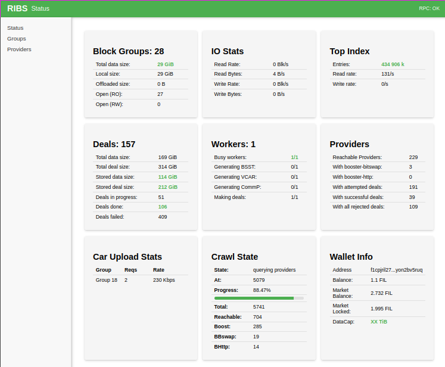

# Filecoin-gw  
**An S3-Compatible Gateway for the Filecoin Network**  
**License:** Apache-2.0 / MIT (dual-licensed)  

Filecoin-gw is an open-source gateway that exposes a fully S3-compatible API backed by the Filecoin network.  
It allows you to try out Filecoin with zero prior knowledge using Docker, making it easy to experiment with decentralized storage.
It provides a scalable blockstore, automated Filecoin dealmaking, and familiar S3 interfaces for seamless data onboarding and retrieval.  

---

## Key Features

- **S3-Compatible Endpoint** — Works with common S3 clients and tooling  
- **Improved Data Locality & Parallelism** — Groups blocks into log-files for efficient storage and Filecoin-friendly formatting  
- **Automated Filecoin Offloading** — Converts full block groups into `.car` files, computes deal CIDs, selects storage providers, and executes deals  
- **Automatic Deal Repair** — Maintains user-defined redundancy by recreating missing or failed deals  
- **Retrieval Probing** — Ensures storage providers provide reliable retrievals  
- **Advanced Storage Provider Selection** — Reputation-based system to select the most reliable providers  
- **Web UI** — Web-based interface for managing nodes and monitoring system status  
- **Flexible Storage Backends** — Block groups can be stored on distributed filesystems or other backends  
- **High Availability & Multi-Node Support** — Group managers can run redundantly; scalable KV store for indexes  
- **Future-Ready Architecture** — Supports additional caching servers, retrieval workers, and session-aware storage drivers  

  

---

## System Requirements

| Resource | Requirement |
|---------|-------------|
| OS | Ubuntu 24.04 |
| CPU | 8 vCPUs |
| RAM | 16 GB |
| Storage | ≥ 128 GB NVMe |

---

## Deployment

### Option 1 — Docker
```bash
apt install -y docker.io docker-compose rclone
git clone git@github.com:CIDgravity/filecoin-gateway.git
cd filecoin-gateway

docker build . -t fgw:local

docker run -it --rm --entrypoint ./gwcfg   -v ${DATA_DIR:-./data}/config:/app/config   -v ${DATA_DIR:-./data}/wallet:/root/.ribswallet   fgw:local -f config/settings.env

docker-compose up
```

#### Data Storage Locations

In Docker mode, the following directories are mounted as volumes:

| Host Path | Container Path | Description |
|-----------|---------------|-------------|
| `${DATA_DIR}/fgw/` | `/root/.ribsdata` | Block groups and sector data (largest) |
| `${DATA_DIR}/wallet/` | `/root/.ribswallet` | Filecoin wallet keys (backup this!) |
| `${DATA_DIR}/ipfs/` | `/root/.ipfs` | IPFS/Kubo data |
| `${DATA_DIR}/yb/` | `/root/var` | YugabyteDB database |

**Changing the Data Location:**

By default, data is stored in `./data/` relative to the docker-compose.yml file. To use a different location (e.g., `/data/fgw-data`), set the `DATA_DIR` environment variable:

**Option 1 — Environment Variable (recommended)**
```bash
export DATA_DIR=/data/fgw-data
docker-compose up
```

**Option 2 — .env File (persistent, not committed)**
Create a `.env` file in the same directory as `docker-compose.yml`:
```bash
echo "DATA_DIR=/data/fgw-data" > .env
docker-compose up
```

**Option 3 — Direct Path Override**
For one-time use without modifying files:
```bash
DATA_DIR=/data/fgw-data docker-compose up
```

> **Note:** The data directory (especially `fgw/`) will grow significantly as you onboard data. Plan for sufficient storage capacity based on your expected data volume.

#### Resetting Data

> **WARNING:** This is a destructive operation that permanently deletes all stored data, including uploaded files, Filecoin deals, and database state. Only use this if you want to completely start over.

To reset all data while keeping your config and wallet:

```bash
docker-compose down && docker-compose run --rm reset-data
```

This removes YugabyteDB data, block groups, and IPFS data, but preserves your `settings.env` and wallet keys.

### Option 2 — Build From Source
#### Prerequisites
- YugabyteDB instance  
- Rclone (optional)  
- Go toolchain  

#### Install
```bash
git clone git@github.com:CIDgravity/filecoin-gateway.git
cd filecoin-gateway

go build -o filecoin-gw ./integrations/kuri/cmd/kuri
go build -o gwcfg ./integrations/gwcfg
```

#### Configure
```bash
./gwcfg
```

#### Start
```bash
source settings.env
./filecoin-gw daemon
```

### Option 3 — Ansible (Multi-Node Clusters)

Use Ansible for deploying production clusters with multiple Kuri storage nodes and S3 frontend proxies.

#### Prerequisites
- Ansible 2.9+
- YugabyteDB cluster (YSQL port 5433, YCQL port 9042)
- Target hosts with Ubuntu 24.04

#### Quick Start
```bash
cd ansible

# 1. Prepare wallet and config
go build -o gwcfg ../integrations/gwcfg
./gwcfg -f settings.env
cp -r ~/.ribswallet files/wallet/

# 2. Create inventory from example
cp inventory/production/hosts.yml.example inventory/production/hosts.yml
# Edit hosts.yml with your servers

# 3. Set secrets with Ansible Vault
ansible-vault encrypt_string 'your-cidgravity-token' --name 'cidgravity_api_token'
# Add output to inventory/production/group_vars/all.yml

# 4. Deploy cluster
ansible-playbook playbooks/site.yml -i inventory/production/hosts.yml

# 5. Verify deployment
ansible-playbook playbooks/verify.yml -i inventory/production/hosts.yml
```

#### Inventory Structure
```
inventory/production/
├── hosts.yml              # Host definitions (kuri nodes, frontends)
├── group_vars/
│   ├── all.yml            # Shared settings (YB hosts, deal settings)
│   ├── kuri.yml           # Kuri node defaults
│   └── s3_frontend.yml    # Frontend defaults
```

#### Example hosts.yml
```yaml
all:
  children:
    yugabyte:
      hosts:
        yb-node-01:
          ansible_host: 10.0.1.10
    kuri:
      hosts:
        kuri-01:
          ansible_host: 10.0.1.11
          fgw_node_id: "kuri_01"
          ribs_data: /data/fgw
        kuri-02:
          ansible_host: 10.0.1.12
          fgw_node_id: "kuri_02"
          ribs_data: /data/fgw
    s3_frontend:
      hosts:
        s3-fe-01:
          ansible_host: 10.0.1.10
          fgw_node_id: "s3_proxy_01"
```

#### Available Playbooks
| Playbook | Description |
|----------|-------------|
| `site.yml` | Full cluster deployment |
| `deploy-kuri.yml` | Deploy/update Kuri nodes only |
| `deploy-frontend.yml` | Deploy/update S3 frontends only |
| `verify.yml` | Health check all services |

#### Operations
```bash
# Add a new Kuri node
ansible-playbook playbooks/deploy-kuri.yml --limit kuri-03

# Rolling update (one node at a time)
ansible-playbook playbooks/deploy-kuri.yml

# View logs on target host
journalctl -u kuri-kuri_01 -f
```

For detailed configuration options, see `ansible/ansible-spec.md`.

---

## Interfaces

| Component | URL |
|----------|-----|
| Backend WebUI | http://localhost:9010/webui |
| S3 Endpoint | http://localhost:8078 |
| Kubo WebUI | http://localhost:5001/webui |

---

## Onboarding Data with Rclone

### Example `rclone.conf`
```
cat > ~/.config/rclone/rclone.conf
[gw]
type = s3
provider = Other
access_key_id = test-access-key
secret_access_key = test-secret-key
region = us-east-1
endpoint = http://localhost:8078
acl = private
```

### Upload Data
```
rclone --s3-no-check-bucket --s3-force-path-style --s3-list-version=2   copy /mnt/data32 gw:mybucket/data32 -v
```

---

## License
Dual-licensed under **Apache 2.0** and **MIT**. See LICENSE files.  

---

## Contributing

Contributions, issues, and feature requests are welcome! Please read our [Contributing Guide](CONTRIBUTING.md) to get started.

---

## Support

Need help? Here's how to get support:

- **GitHub Issues** — [Report bugs or request features](https://github.com/CIDgravity/filecoin-gateway/issues)
- **Filecoin Slack** — Join the **#filecoin-gateway** channel on [Filecoin Slack](https://filecoin.io/slack) for community discussion
- **Contributing** — See our [CONTRIBUTING.md](CONTRIBUTING.md) for guidelines on contributing to the project
- **CIDGravity Support** — For enterprise support and service-related questions, visit [CIDGravity](https://www.cidgravity.com/contact)
