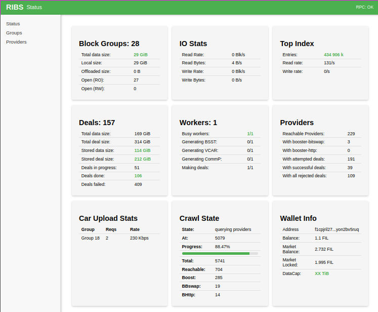

# RIBS

> Reasonable Interplanetary BlockStore (RIBS)

RIBS is a Filecoin-native IPFS/IPLD blockstore designed for seamless integration
with the Filecoin tech stack. It provides users with a scalable blockstore
capable of handling almost arbitrary amounts of data. RIBS aims to be an
auto-dagstore-like blockstore with fully automated Filecoin data offload support.

# WORK IN PROGRESS

**RIBS is a work-in-progress project. Most features aren't finished, and on-disk
format is not stabse. DO NOT USE FOR STORING CIRTICAL DATA, OR ANY OTHER DATA**

**Status:**
* Data layer is mostly implemented, but needs a lot of hardening to gain
  confidence that it never loses data.
* API Implementation is mostly complete, but there is a lot of space for optimization.
* Filecoin dealmaking process is mostly implemented.
* RIBSWeb is mostly complete and covers existing functionality.
* Kubo integration (KuboRIBS - KuRI) works, but needs some UX improvements.
* Retrieval probing / retrieval functionality is not implemented yet.
* Multi-node support is not implemented yet.

# Key Features

**Filecoin-native IPFS nodes**: RIBS can be integrated into most IPFS nodes
seamlessly, thanks to a layer that implements the standard Blockstore interface.
RIBS also provides a high-performance block interface for more efficient data
management.

**Scalable blockstore**: RIBS is designed to support 100PiB+ deployments, providing
a scalable solution for distributed storage systems that can grow alongside user
requirements.

**Improved data locality and parallelism**: RIBS groups blocks into log-files,
which in many scenarios provide good data locality, and are very easy to convert
into Filecoin-deal-friendly data format.

**Fully automated Filecoin data offloading**: When block groups become "full",
RIBS automatically backs them up to Filecoin, by converting them into a .car
file, computing deal CID, selecting SPs, and making deals. RIBS will also provide
an offloading mechanism, which will make it possible to free up space on the
local storage by removing the backed-up blocks, and fetching them from Filecoin
when needed.

**RIBSWeb**: RIBSWeb is a web-based UI for RIBS, which provides an advanced, but
easy-to-use interface for managing RIBS nodes, and monitoring their status.



# Design Overview / Roadmap


**Grouping blocks**: RIBS groups blocks into log-files, which provides better
performance on all drives, including HDDs and SSDs. This approach leads to
improved data locality, allowing for better parallelism and easier offloading to
Filecoin data chunks.

**Local data index**: RIBS maintains a local index of all blocks, which allows
for efficient access to all block data, including offloaded blocks. Multiple
backends will be supported for multi-node deployments, such as FoundationDB.

**Filecoin dealmaking functionality**: RIBS automates all steps of the Filecoin dealmaking process:


* **Storage Provider crawler**: Discovers and monitors storage providers in the network.
* **Efficient on-the-fly .car file generation**: RIBS can generate .car files in one 
  sequential scan of a group log.
* **Fast DataCID computation**: RIBS Uses all available cores to comput DataCID as fast as possible.
* **Advanced SP selection process**: Utilizes a built-in reputation system to select
  the most suitable storage providers based on their performance and reliability.
* **Retrieval probing**: Attempts retrievals for a random sample of data, to ensure
  that SPs provide the promised retrieval service. Unretrievable deals will not
  count torwards the redundancy factor, and SPs who fail to provide retrievals
  will be selected for deals much less frequently.
* **Automatic deal repair**: Maintains a user-defined redundancy factor by
  automatically repairing and recreating deals as needed.

**Arbitrary scalability**: All parts of RIBS are designed to scale horizontally, 
allowing for almost arbitrary amounts of data to be stored.

*multi-node support is not implemented yet*

* Group files can be stored on any storage backend, including distributed
  filesystems, and can be managed by a fleet of "Group workers" which can run
  tasks such as DataCID computation, car file creation, etc.
* Local data index ("Top Level Index") can be backed by any scalable KV store
* "Group Manager" processes can run redundantly to provide high availability
* (Future) Users can deploy additional car file caching servers to improve
  efficiency of making redundant deals.
* (Future) Retrievals can be served by a fleet of "Retrieval workers".
* (Future) Access to storage is provided by a smart, session-aware driver, which can talk
  directly to the relevant parts of the cluster.

# Usage

### Integrating as a blockstore

*Interface not stable yet*

* Main interface definition [here](https://github.com/lotus-web3/ribs/blob/main/interface.go)
* Can be wrapped into a standard IPFS blockstore using [Blockstore layer](https://github.com/lotus-web3/ribs/blob/main/integrations/blockstore/ribsbs.go)
* Example Kubo plugin [here](https://github.com/lotus-web3/ribs/blob/main/integrations/kuri/ribsplugin/kuboribs.go)

### Running (demo) Kubo-Ribs (KuRI) Node

* Install Golang
* Clone this repo

```
git clone https://github.com/lotus-web3/ribs.git
cd ribs
go build -o kuri ./integrations/kuri/cmd/kuri
```

* **backup / move away .ipfs / set IPFS_PATH to an alternative directory if you have a local IPFS node**
* Init KuRI node and start the daemon

```
./kuri init
./kuri daemon
```

// todo note how to setup wallet

* Use the node, like any Kube node!

```
./kuri add README.md
```

* Kuri CLI/API is the same as Kubo
* IPFS WebUI is available at http://localhost:5001/webui. The files tab can be
  used as essentially an infinite-storage file browser.
* RIBSWeb is served at http://127.0.0.1:9010